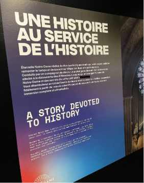
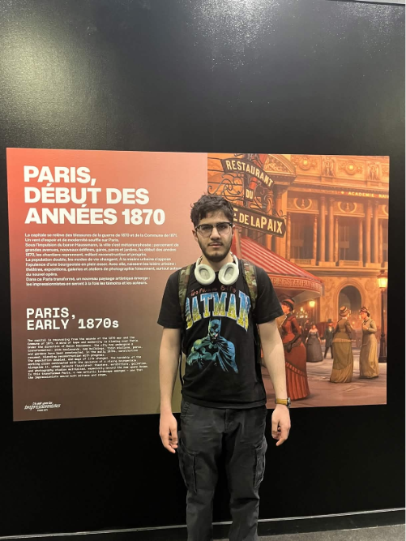
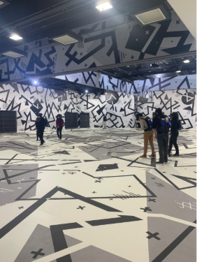
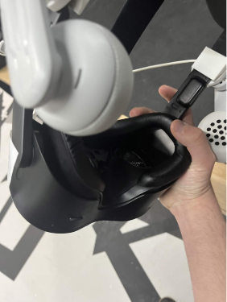

# Fiche sur l'exposition à *l'arsenal des arts de Montréal*.

 

## Nom de l'exposition ou de l'évènement: 
Le nom de l'exposition se nomme *Éternelle Notre-Dame* situé à l'Arsenal des Arts de Montréal.
 

<blockquote>La photo a été prise par Ahmed El-Mekari.</blockquote>

 

## Lieu de mise en exposition:
Le lieu de l'exposition est situé à l'Arsenal des Arts de Montréal.
 

<blockquote>La photo a été prise par un des employé.</blockquote>

 

## Type d'expostion: 
C'est une exposition de type permanente et intérieure. La date de début était en Janvier 2026 et il n'y a pas d'informations sur une dâte de fermeture. 

 

## Date de la visite:
19 Février 2026:

 

Le dispoitif est un casque RV fait par Meta. Comme l'indique sur le site suivant dans la section de descrpition de l'experience. 

 

## Nom de l'artsite: 
La compagnie derrière cette oeuvre se nomme *Excurio*. 

 

## Année de réalisation:
Le projet a commencé en 2019. La finale était en 2022.

 

## Descrpition de l'oeuvre:
*Entrez dans la cathédrale la plus emblématique de France et explorez-là comme jamais auparavant. Éternelle Notre-Dame vous transporte à travers la cathédrale Notre-Dame de Paris pour retracer 850 ans d’histoire. Vous découvrirez le rôle qu’elle a joué dans les triomphes, les épreuves et les transformations qui ont contribué à façonner la ville de Paris que nous connaissons aujourd’hui. Soyez témoin du savoir-faire exceptionnel déployé depuis sa construction médiévale jusqu'à sa restauration actuelle suite à l’incendie dévastateur de 2019. Découvrez les artisans et les figures historiques qui ont contribué à bâtir son héritage pour en faire l’une des silhouettes urbaines les plus emblématiques du monde. Parcourez les lieux où des générations se sont rassemblées et ressentez l’esprit intemporel qui fait de Notre-Dame de Paris un monument vivant de foi, d’art et de résilience.*
<blockquote>Le texte a été pris du site officiel de la compagnie qui a fabriqué l'experience RV.
[Référence](https://eternelle-notre-dame.ca)1
 </blockquote>

  

## Vue d'ensemble:

<blockquote>Photo prise par Manon Michel du Site CNEWS2</blockquote>

 

## Fonction du dispositif Multimédia 

<blockquote>La photo a été prise par Ahmed El-Mekari</blockquote>
- Comme vous pouvez le voir, l'appareil est un casque R.V appartenant à la marque Vive. Le casque est fonctionne comme un casque R.V normal. Nous le mettons et nous pouvons voir des images. Toute la beauté vient dans la programation à l'intérieur de ce casque. Le casque possède de mulitples capteurs nous permettant de voir les autres participants. Le code se fait tout à l'écran. Le 95% de l'oeuvre est dans la machinerie et la programmation. Toutes les voix ont étées programmées pour donner un goût à l'oeuvre. La magie commence quand nos yeux se collent à la machine.
