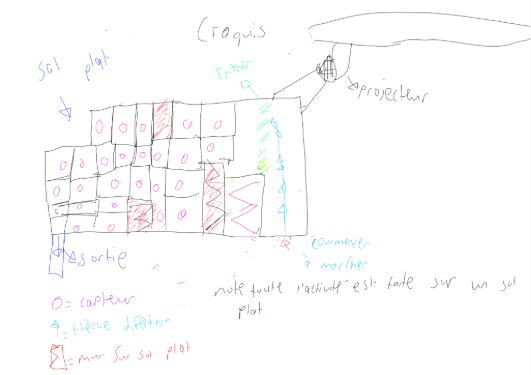
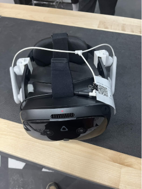
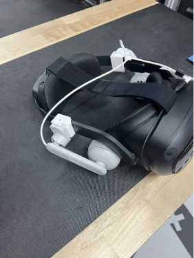
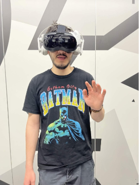

# Fiche sur l'exposition à *l'arsenal des arts de Montréal*.

 

## 1. Nom de l'exposition ou de l'évènement: 
Le nom de l'exposition se nomme *Éternelle Notre-Dame* situé à l'Arsenal des Arts de Montréal. Sur la droite, Je suis devant une même affiche.
 
 

## 2. Lieu de mise en exposition:

<blockquote>La photo de la fiche a été prise par Ahmed El-Mekari. Ma propre personne en photo a été prise par un des employé.</blockquote>

 

 

## 3. Type d'expostion: 
C'est une exposition de type permanente et intérieure. La date de début était en Janvier 2026 et il n'y a pas d'informations sur une dâte de fermeture. 

 

## 4. Date de la visite:
19 Février 2026:

 

Le dispoitif est un casque RV fait par Meta. Comme l'indique sur le site suivant dans la section de descrpition de l'experience. 

 

## 5. Nom de l'artsite: 
La compagnie derrière cette oeuvre se nomme *Excurio*. 

 

## 6. Année de réalisation:
Le projet a commencé en 2019. La finale était en 2022.

 

## 7. Descrpition de l'oeuvre:
- Cartel présent sur le site officiel. 
*Entrez dans la cathédrale la plus emblématique de France et explorez-là comme jamais auparavant. Éternelle Notre-Dame vous transporte à travers la cathédrale Notre-Dame de Paris pour retracer 850 ans d’histoire. Vous découvrirez le rôle qu’elle a joué dans les triomphes, les épreuves et les transformations qui ont contribué à façonner la ville de Paris que nous connaissons aujourd’hui. Soyez témoin du savoir-faire exceptionnel déployé depuis sa construction médiévale jusqu'à sa restauration actuelle suite à l’incendie dévastateur de 2019. Découvrez les artisans et les figures historiques qui ont contribué à bâtir son héritage pour en faire l’une des silhouettes urbaines les plus emblématiques du monde. Parcourez les lieux où des générations se sont rassemblées et ressentez l’esprit intemporel qui fait de Notre-Dame de Paris un monument vivant de foi, d’art et de résilience.*
<blockquote>Le texte a été pris du site officiel de la compagnie qui a fabriqué l'experience RV.
[Référence](https://eternelle-notre-dame.ca)1
 </blockquote>

  

## 8. Vue d'ensemble:

<blockquote>Photo du site de l'exposition de l'intérieur prise par Manon Michel du Site CNEWS2.</blockquote>

 

## 9. Fonction du dispositif Multimédia 

<blockquote>La photo a été prise par Ahmed El-Mekari</blockquote>
- Comme vous pouvez le voir, l'appareil est un casque R.V. appartenant à la marque Vive. Le casque fonctionne comme un casque R.V. normal. Nous le mettons et nous pouvons voir des images. Toute la beauté vient de la programmation à l'intérieur de ce casque. Le casque possède de mulitples capteurs nous permettant de voir les autres participants. Le code se fait tout à l'écran. 95 % de l'œuvre est dans la machinerie et la programmation. Toutes les voix ont été programmées pour donner un goût à l'œuvre. La magie commence quand nos yeux se collent à la machine. Le casque R.V possède aussi des haut-parleurs pour avoir une écoute plus satisfaisante. 

 

## 10. Mise en espace 

 

## 11. Composantes techniques:

 

### Nous pouvons voir une vue d'ensemble du casque. Nous pouvons voir ensuite une vue de coté. Enfin, voici une photo d'une position rapprochée où nous posons nos yeux.
  
<blockquote>Note: les 3 photos ci-dessus ont été capturées par Ahmed El-Mekari.</blockquote>
 

## 12. Éléments nécéssaires à la mise en exposition:
- Les murs comme dans la photo ci-dessous, sont importants, car ils donnent un signal lorsque nous sommes dans l'exposition pour nous montrer qu'il y a un mur. Les parties noirs sont remplis de capteurs. Bien sûr, la lumière est très importante, car elle nous donne accès à l'exposition dans le casque R.V.

 

<blockquote>Photo d'un des murs de l'exposition prise par Ahmed El-Mekari.</blockquote>

 

## 13. Expérience vécue:
- Je n'ai pas pu accéder à une photo personelle dans l'exposition, mais comme vous le voyez ci-dessous, je suis avec le casque R.V. L'expérience véue était sublime. Tout était dans les yeux. Chaque personne a eu son propre personnage.

 

<blockquote>Ma propre personne en photo a été prise par un des employé.</blockquote>

 

## 14. Ce qui m'a plu:
- Ce qui m'a plu est l'expérience en soi. J'étais mis dans le passé pour voir les vertiges de la *Cathédrale de Notre-Dame de Paris* avant et après l'incendie en 2019. De plus, l'expérience offrait un travail de perspective fonctionnel. En effet, la perspective de quand nous montons les escaliers ou étions dans un ascenseur m'a donné l'effet d'être vraiment présent dans la vraie vie et non dans un monde virtuel. Enfin, le personnel était gentil et accueillant.

 

## 15. Aspect à retenir pour ne pas faire d'erreurs dans mes propres expositions dans le futur:
- L'accessibilité aux personnes portant des lunettes est très faible. En effet, c'est dommage qu'il faille ajuster le casque à chaque fois et même en ajustant le casque. Nous pouvons tout de même ne pas avoir un confort appréciable. Une personne qui possède des lunnettes doit avoir le droit d'aimer une activité sans trop qu'il y a un conflit.

 

## 16. Références:
1. [Dans ce lien vous trouverez le cartel présent dans le point 7 à l'identique.]https://eternelle-notre-dame.ca
2. [Dans ce lien vous trouverez la photo présent dans le point 8 à l'identique. Je le répète. La photo a été prise par Manon Michel et publiée dans l'article suivant.][https://eternelle-notre-dame.ca](https://www.cnews.fr/culture/2022-01-13/eternelle-notre-dame-teste-et-adore-lexperience-en-realite-virtuelle-1170455)
