**1. Le nom de l'exposition ou de l'événement**
   - *La galérie des arts de l'Université de Montréal* Voici une photo montrant l'affiche de l'éxposition.
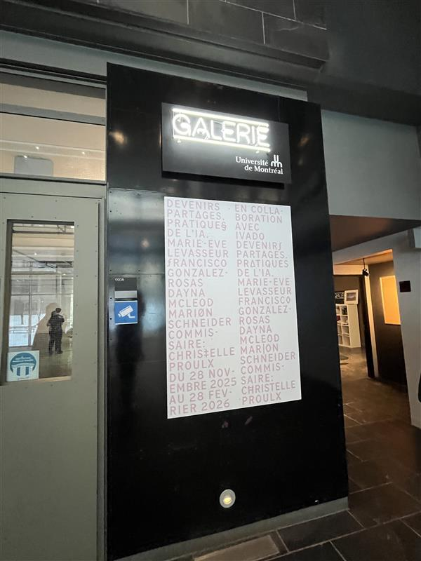

 

**2. Lieu de mise en exposition**

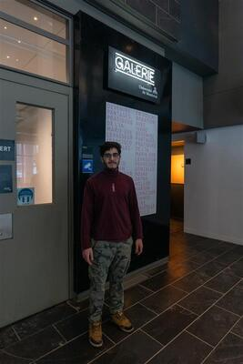

**3. Type d'exposition**
   - temporaire et intéractive. En effet, l'exposition montre des produits faitent par des artistes de la saison du printemps. Elle est inéractive, car je peux intéragir avec l'art. L'art est une image projeté par une Ai qui vient des ondes d'un petit casque qui se met sur la tête.
  
**4. Date de votre visite.**
   - 29 janvier 2026
  
 

**5. Titre de l'oeuvre**
   -*Terre Commune*
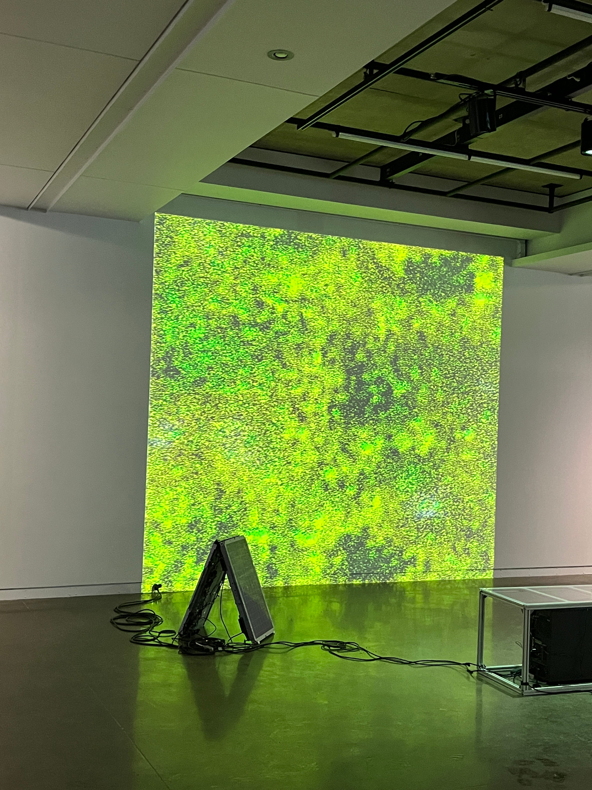 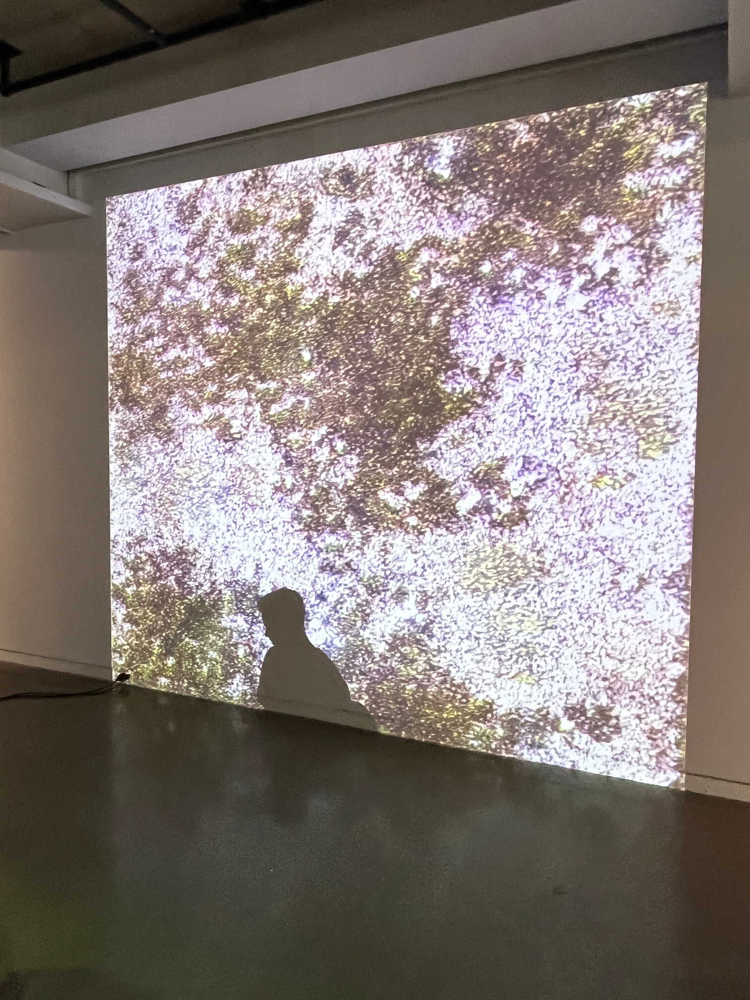

 

**6. Auteur de l'oeuvre**
   - Devenirs partagés: pratiques de l’IA est la compagnie qui a fait un partonariat avec l'UDM. Cependant, l'artiste qui est dans la compagnie qui a fait l'oeuvre se nomme Marion Schneider.

 

**7. Année de création**
   - 2025

 

**8. Description de l'oeuvre ou du dispositif**
   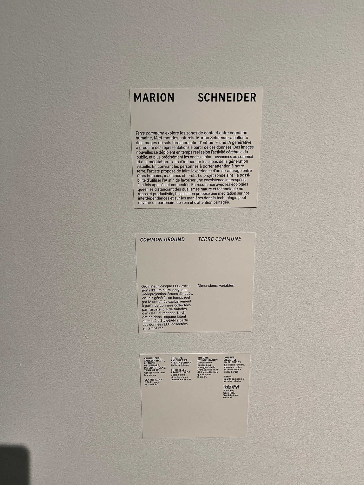
   - Le point de cette oeuvre est qu'elle va réussir à capter les ondes alphas du cerveau grâce à un bandeau que nous accrochons sur notre frond pour aider à générer une image générative faite par l'IA. Tout cela est pour faire un        sorte de lien entre humains et machines.

 

**9. Type d'installation (contemplative, immersive, interactive)**
   - C'est une installation interactive. Nous nous posons sur un le banc qui a été montré sur les photos précédentes par rapport à la vue d'ensemble de l'oeuvre. Sur cette photo, nous remarquons un certain bandeau à enfiler. C'est        dans cette partie de l'oeuvre que l'exposé est interactive. Le goût de l'oeuvre et l'oeuvre en elle-même font partis de la collaboration d'un partipant.  
    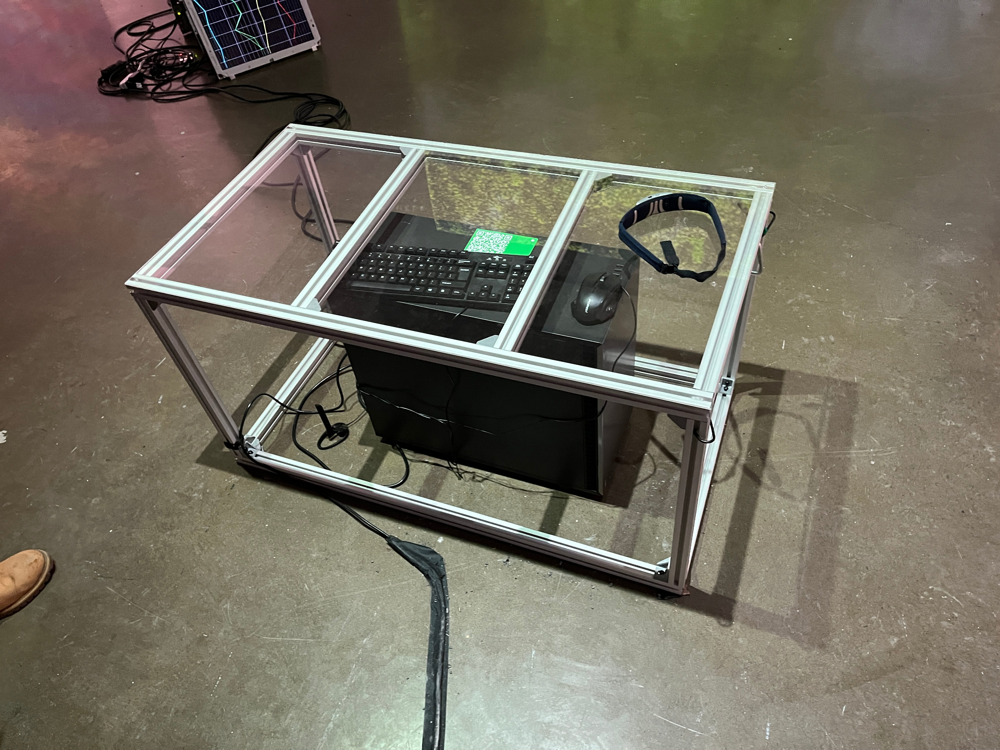

 

 **10. Fonction du dispositif multimédia** 
 - Après que nous nous sommes assis(eS), nous allons prêter attention à cette rangé de ligne. Chaque ligne est une onde alpha du cerveau qui transmet, donc à la grande machine derrière les besoins nécéssaires pour faire ses calculs
   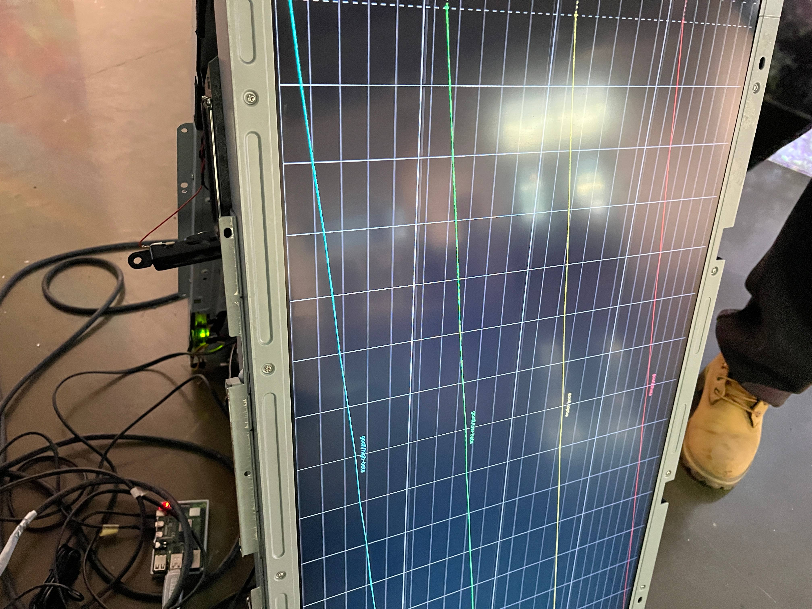

    
   
 - La photo si-dessous vous montra la partie enrichissante de cette exposition. En effet, cette machine va envoyer les ondes alphas du cerveau à la machine pour qu'elle les lisent. Le systèeme est en constant travail.
    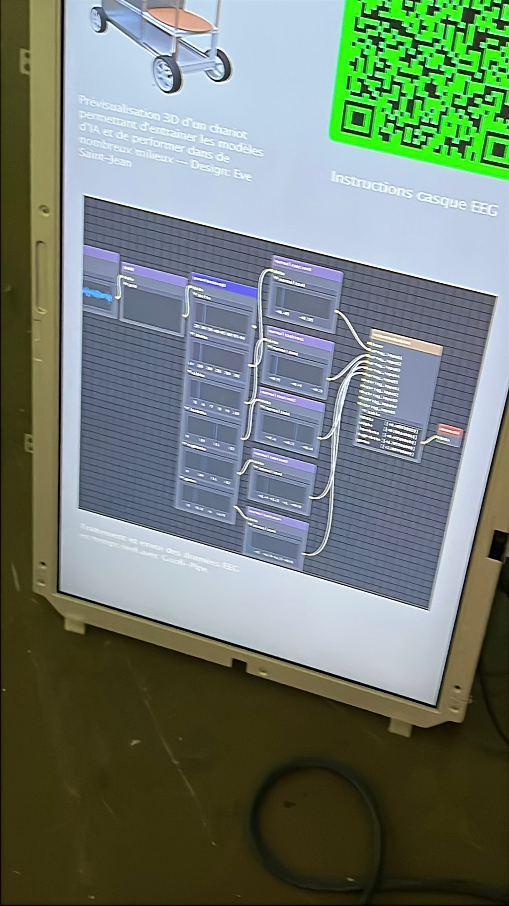

 

**11. Mise en espace**
 - CROQUIS DE L'IMAGE
    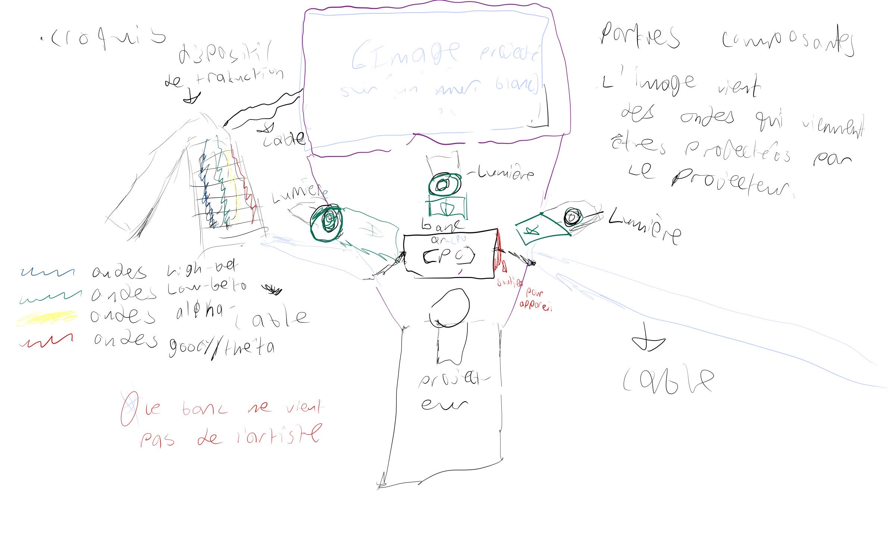
 -  Le texte a déja été disposé explicant de comment l'appareil ou l'oeuvre fonctionnait.

 

**12. Composantes et techniques**
 -  Voici une vue complète de chaque pièece de l'oeuvre.
 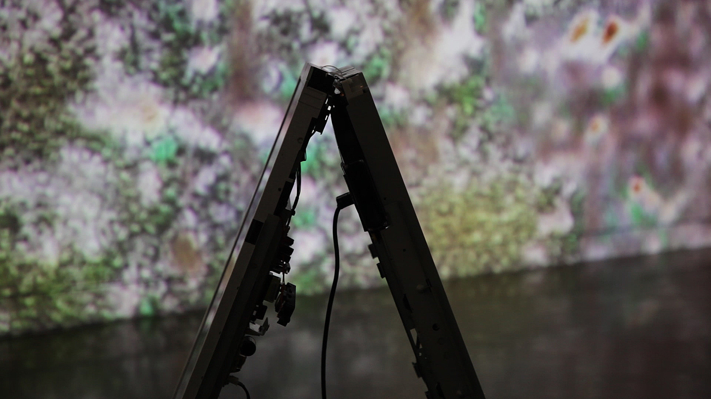
 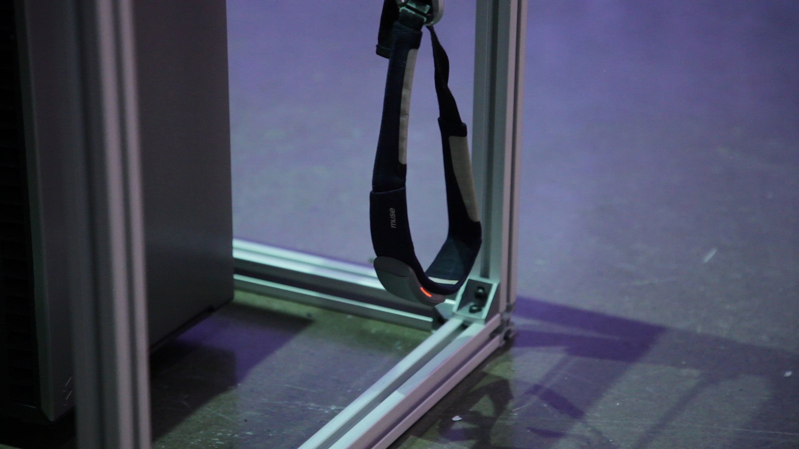
 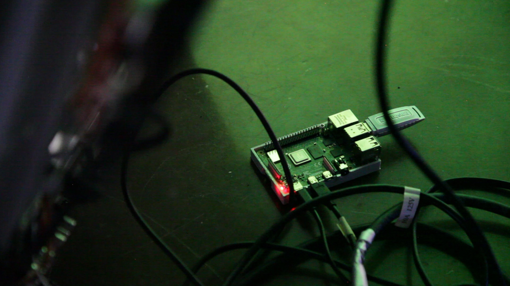
 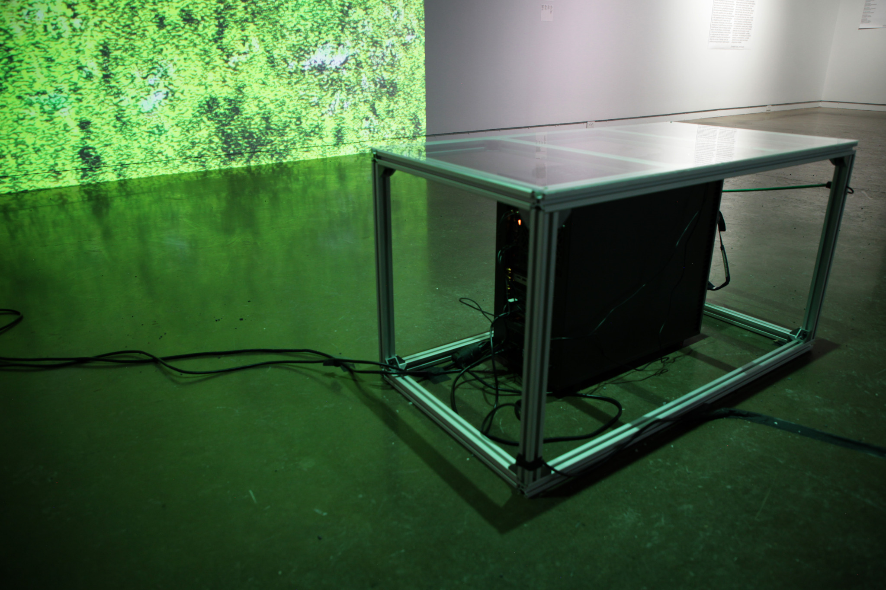
 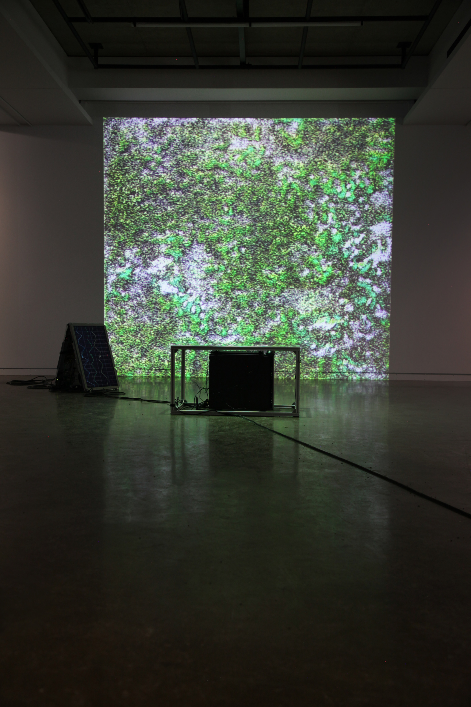
 

