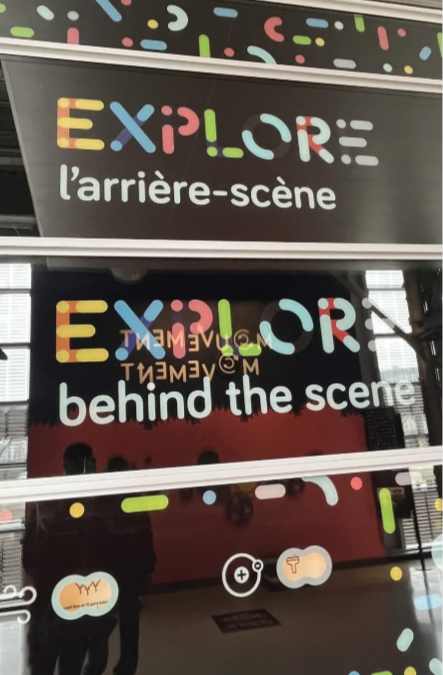
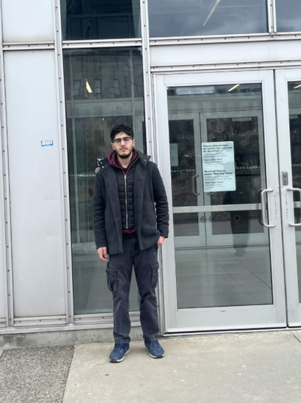
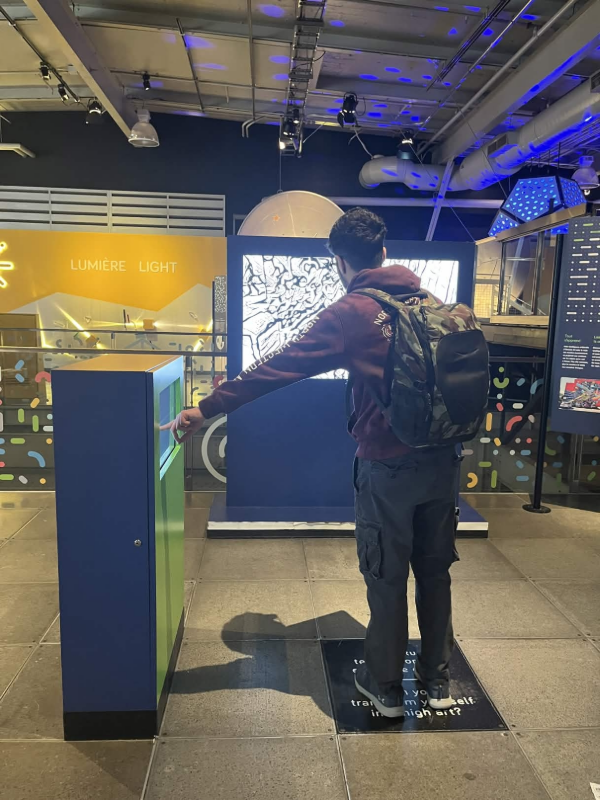
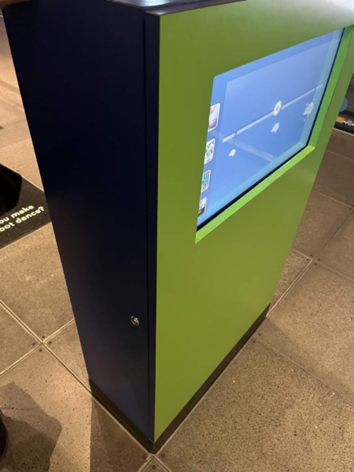
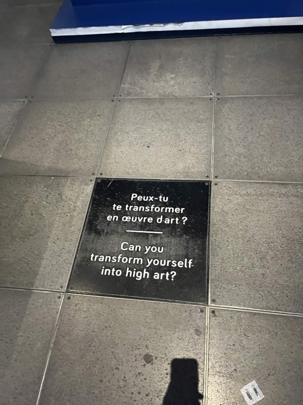
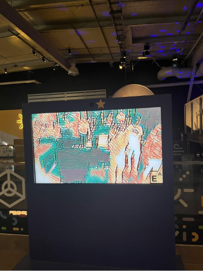

# FICHE SUR L'EXPOSITION *EXPLORE*

 

## 1. Informations sur l'oeuvre en général 

 

**Nom de l'exposition ou de l'évènement:** 
 

Le nom de l'exposition se nomme *EXPLORE - LA SCIENCE EN GRANDE*.

 

 

**Lieu de Mise en exposition**

 
Le lieu de l'exposition est au Centre des Sciences de Montréal. Voilà ume photo de moi devant l'entrée.

 
<blockquote>La photo de Ahmed El-Mekari devant l'entrée du Centre des Sciences a été faite par ⁠Rivard-Septimus Alexandre</blockquote>

 

**Type d'expostion:**
C'est une exposition de type permanente et intérieure. La date de début était . La date de fin est 

 

**Date de la visite:**
2 Avril 2026.

 

**Titre du dispositif:**
Le titre du dispositif est__.

 

 

 

## 2. Description sur le côté technique de l'exposition: 

 

**Nom des créateurs et créatrices:**
 

 

**Année de réalisation:**

1 mai 2019 est la date du début et le 1 mai 2029 est la date de fin de l'ensemble de l'exposition *EXPLORE* qui contient mon oeuvre choisi.

 

**Descrpition de l'oeuvre:**
**Cartel présent sur le site officiel.** 
*La science en grand
L’activité familiale interactive parfaite pour expérimenter la science! En termes d’activités à faire à Montréal, Explore maîtrise la science de l’amusement. Découvrez la science derrière le mouvement, l’air, la lumière, l’eau, la géométrie, la matière et le code avec une bulle de savon géante, des tables à eaux, une grue et de nombreuses autres activités.*

*Tout est dans la mécanique Découvrez l’univers ingénieux des machines simples comme les poulies, les engrenages et les leviers (en format géant!), laissez-vous déboussoler par l’effet gyroscopique à l’aide d’une roue libre et relevez le défi collaboratif d’illuminer un éclair géant en transformant vos mouvements en électricité. À la conquête du vent Explorez un élément invisible, mais d’une force tout à fait réelle. Venez jouer avec le vent, expérimenter la pression de l’air, ressentir l’effet d’une tornade et vous laisser fasciner par les trajectoires surprenantes d’un labyrinthe à air. Source de découvertes Vous serez heureux comme un poisson dans l’eau en batifolant autour de deux tables à eau qui vous révèleront les nombreuses forces et inventions que nous procure cette source de vie. Construisez des parcours d’eau, observez un véritable vortex et générez même de l’électricité!*
<blockquote>Le texte a été pris du site officiel de la Société des Musées du Québec.*
[Référence](https://www.musees.qc.ca/decouvrir-musees/calendrier-expositions/centre-des-sciences-de-montreal-explore-211/)1
 </blockquote>

  

## 3. Descrpition technologique de l'exposition:

**Vue d'ensemble:**

<blockquote>Photo faite par Ahmed El-Mekari de la vue d'ensemble.</blockquote>

 

**Fonction du dispositif Multimédia**

<blockquote>La photo a été prise par Ahmed El-Mekari</blockquote>

 

**Mise en espace** 

<blockquote>Croquis pris du Site Officiel Github de l'équipe de *Terminal*.https://pythons-5.github.io/Terminal/#/concept/</blockquote>
 

**Composantes techniques:**

 

## Nous pouvons voir la tablette qui permet de controller quel mode nous voulons voir sur le gros écran (la photo en dessous de la tablette), une pancarte accrochée au sol pour une guide dans l'oeuvre. Enfin, l'écran pour visualer l'art. 
   
<blockquote>Note: les 3 photos ci-dessus ont été capturées par Ahmed El-Mekari.</blockquote>
 

## 4. Section Informations 

**Éléments nécéssaires à la mise en exposition:**
-L'exposition ne possèbe pas de cable visible. Un énorme talent. Tout est caché sous les petits carrées de métals comme montré dans les aspects technologiques de l'oeuvre. La plaque pour le guide de l'oeuvre possède en dessous d'elle, plusieurs fils.

 

**Expérience vécue:**

 

 

 

**Ce qui m'a plu:**
- Ce qui m'a plu est l'expérience en soi. J'ai trouvé l'aspect de l'IA qui change le résultat de son art avec dépendament de ce que l'utilisateur choisi. En effet, sur la tablette, il y a 4 choix comme présentés et j'ai adoré comment le résultat changeait si vite. L'oeuvre était facile à comprendre et très passionnante. Enfin, l'aspect que l'IA s'inspire de vraies oeuvres pour sa création me donne un sourire, car dans le monde d'aujourdh'ui, nous sommes à la mercie d'une copie à l'IA.

 

**Aspect à retenir pour ne pas faire d'erreurs dans mes propres expositions dans le futur:**
- Rester un peu plus sur le public visé. En effet, l'exposition est amusante pour quelqu'un qui ne comprend pas le concept de l'IA derrière, mais quelqu'un qui comprend l'IA possède un sens différent. De plus, l'IA est un bon outil, mais je trouve que nous aurions pu ajouter une touche d'humain comme un dessin sur un papier et l'IA copie avec le style des artistes qu'elle s'inspire.
 

## Références:
1. Dans ce lien vous trouverez le cartel présent dans le point de la description à l'identique. [Cliquez ici!]( https://www.musees.qc.ca/decouvrir-musees/calendrier-expositions/centre-des-sciences-de-montreal-explore-211/)
