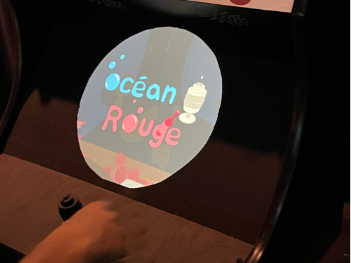
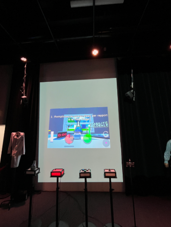
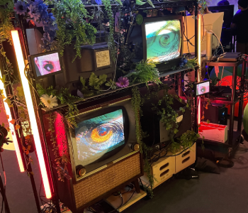
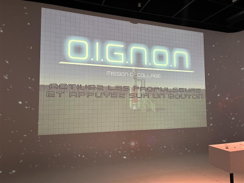

# FICHE PALAMRES DES OEUVRES DES FINISSANTES

 

## NO ordre de préférence 
## 6ème place: *Arbre en Face*.
### Noms des créateurs et créatices:
<ul>
  <li>Alexandre Gendron.</li>
  <li>Mikael Arseneau.</li>
  <li>Mathieu Willett.</li>
  <li>Matis Gharian.i</li>
  <li>Rafael Angon Dube.</li>
</ul>

**Installation en cours (vue ensemble)**

 

.

**Ce que je ressens en expirémentant chacune des installations.**
- Je ressens un sentiment de ne pas être si content. Ce n'est pas de l'ennui ou de la déception, mais du côté de << Cela ne m'intéresse plus. Impréssionant comment c'est fait par contre >>. En effet, je trouve que durant la premièere visite, j'ai été choqué de voir ma face être dans une fleur. Cependant, j'étais devenu très ennuyé, car l'experience d'utilisateur m'est pas si complète. Nous glissons notre doigt de haut en bas et c'est tout. Enfin, cette ouevre peut se résume juste en quelques mots. << Glisse ton doigt pour 2 minutes. >> Je suis une personne qui aime les jeux intéractifs comme l'oeuvre du vaisseau spacial.  

 

## 5ème place: *Océan Rouge* 
### Nom des créatrices: 
<ul>
  <li>Amira Tounekti</li>
  <li>Kristy Moussally</li>
</ul>

### Installation en cours (vue ensemble)
.

**Ce que je ressens en expirémentant chacune des installations**
- Je ressens un vide. En effetmje trouve que l'idée est original, mais le problème est que le jeu devient ennuyant extrèmement vite! De plus, le jeu se concentre dans un environnement où nous sommes dans notre popre bulle. Je n'aime pas rester coincé. Cependant, l'activité a un sens que je trouve intéressant. Le sens de jouer tout en ayant pour but de faire quelque chose d'utile. Dans ce cas, enlever la pollution. 

## 4ème place: *Symbiose*
### Noms des créateurs et créatices:
<ul>
<li>Yannick Chamberland</li>
<li>Benjamin Ferland</li>
<li>Ryan Dufault</li>
<li>Walid Cheour</li>
</ul>

### Installation en cours (vue ensemble) 

**Ce que je ressens en expirémentant chacune des installations**
- Je ressens ce qu'un scientifique vie. En effet, je trouve que de jouer avec des potions et la quantité m'a mis dans un costume de scientifique. De plus, j'ai aimé la pensée derrière, car la logique de si nous ajoutons trop d'eau, la recette peut se rater. Un vrai thème scientifique que j'ai exploré dans ma vie dans le passé, mais ce n'est plus mon thème, donc je me dois de mettre cette oeuvre dans la 4ème place.

 

## 3ème place: *Quand les yeux se croisent*.
### Noms des créateurs et créatices. 
<ul>
  <li>Edelwyn Ledru</li>
  <li>Félix Lavoie</li>
  <li>Jade Hébert</li>
  <li>Manel Yaya</li>
  <li>Patricia Nassif</li>
</ul>

  

### Installation en cours (vue ensemble) 
.

**Ce que je ressens en expirémentant chacune des installations**
- Ce que je ressens est une grand curiosité. En effet, je trouve que jouer avec nos yeux pour avoir un effet dans un écran est très intéréssant. De plus, comment l'écran a été fait et toutes les préparations sur l'envoie d'image est incroyable. J'ai été déçu que je devais attendre quelques heures pour avoir mon résultat sur l'écran. Par contre, je ne dénie pas le travail qui m'a donnée envie d'essayer l'exposition.

 

## 2ème place: *Mission*.
### Noms des créateurs :
<ul>
<li>Ahmed Kaissoumi</li>
<li>Radhouane Kordan</li>
<li>Justin Montpetit</li>
<li>Thearylou Lach</li>
<li>Jad Saloumi</li>
</ul>
  

### Installation en cours (vue ensemble) 
.

**Ce que je ressens en expirémentant chacune des installations**
- Ce que je ressens est un énorme plaisir. J'aime tout ce qui est dure. Le jeu tout seul me donne la sensation d'être dans l'espace! J'ai ressenti aussi un sentiment d'alerte. En effet, j'avais une peur de me tromper. Je ne voulais pas que le vaisseau sot brisé! De plus, je trouve ce jeu accessible à deux ou trois. Lorsque j'ai su que je pouvais jouer avec mes amis, j'ai tout de suite aborder le vaisseau. Un grand plaisir!!! 
