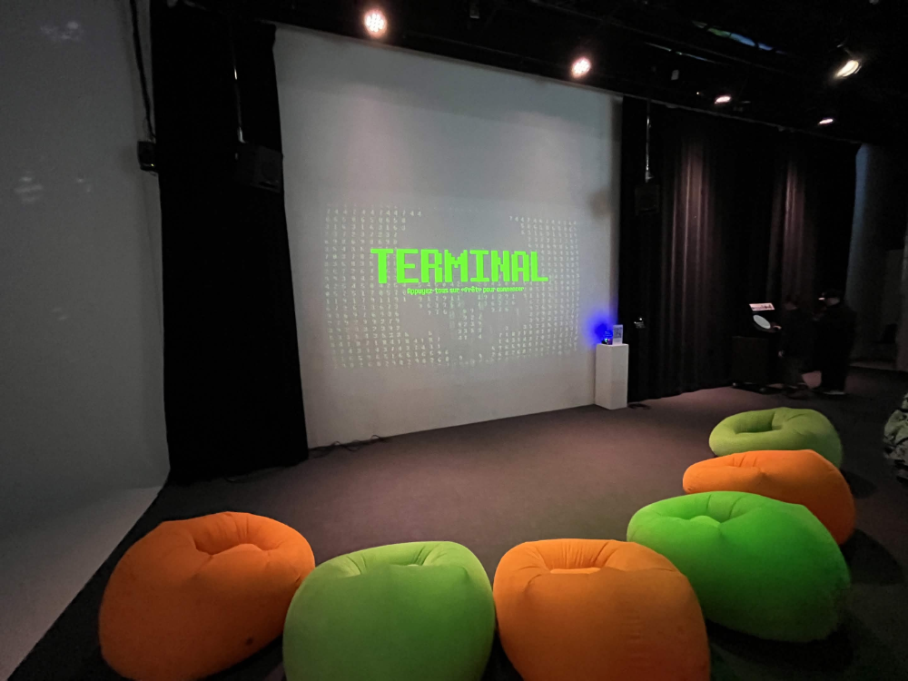

# FICHE SUR L'EXPOSITION TERMINAL

 

## 1. Informations sur l'oeuvre en général 

 

**Nom de l'exposition ou de l'évènement:** 
 
Le nom de l'exposition se nomme *EXPOSITION DES ÉTUDIANT.E.S FINISSANT.E.S EN TIM*.
 

 

 

**Type d'expostion:**
C'est une exposition de type temporaire et intérieure. La date de début était le 24 février 2026. La date de fin est le 18 mars 2026 

 

**Date de la visite:**
24 février 2026
18 mars 2026
 

 

## 2. Description sur le côté technique de l'exposition: 

 

**Nom des créateurs et créatrices:**
 

<ul>
<li>Émeryk Bélisle</li>
<li>Elie Daher</li>
<li>Ting Yung Lu Terry</li>
<li>Dana Saavedra-Torrano</li>
<li>Mégane Ranger</li>
</ul>

 

**Année de réalisation:**
Le projet a commencé en 2925. La finale était en 2026.

 

**Descrpition de l'oeuvre:**
- Cartel présent sur le site officiel. 
*TERMINAL est un jeu collaboratif pouvant accueillir jusqu’à 6 joueurs. Chaque joueur contrôle un opérateur, grâce à la manette sur leur téléphone, qui essaie de trouver l'accès au vieux réseau internet afin de restaurer les données qui ont été corrompues par une cyberattaque orchestrée par un fameux pirate informatique. Lorsque les joueurs vont se déplacer, une ligne suit leur trajectoire et devient un obstacle pour les autres opérateurs. L’objectif est que tous les joueurs atteignent la fin des niveaux sans être éliminés par les obstacles laissés dans le réseau par le pirate ou par les traces laissées par les autres. En cas d’élimination, tous les joueurs doivent recommencer le niveau depuis le début. Au fur et à mesure de la progression, les niveaux deviennent de plus en plus complexes, introduisant par exemple des boutons qui ouvrent des passages pour les autres, des obstacles mobiles et bien plus encore.*
<blockquote>Le texte a été pris du site github de l'équipe de *Terminal*
[Référence](https://pythons-5.github.io/Terminal/#/)1
 </blockquote>

  

## 3. Descrpition technologique de l'oxposition:

**Vue d'ensemble:**

<blockquote>Photo faite par Ahmed El-Mekari de la vue d'ensemble.</blockquote>

 

**Fonction du dispositif Multimédia**

<blockquote>La photo a été prise par Ahmed El-Mekari</blockquote>

 

**Mise en espace** 

<blockquote>Croquis pris du Site Officiel Github de l'équipe de *Terminal*.https://pythons-5.github.io/Terminal/#/concept/</blockquote>
 

**Composantes techniques:**

 

### Nous pouvons voir une vue d'ensemble du casque. Nous pouvons voir ensuite une vue de coté. Enfin, voici une photo d'une position rapprochée où nous posons nos yeux.
  
<blockquote>Note: les 3 photos ci-dessus ont été capturées par Ahmed El-Mekari.</blockquote>
 

## 4. Section Informations 

**Éléments nécéssaires à la mise en exposition:**
- Les murs comme dans la photo ci-dessous, sont importants, car ils donnent un signal lorsque nous sommes dans l'exposition pour nous montrer qu'il y a un mur. Les parties noirs sont remplis de capteurs. Bien sûr, la lumière est très importante, car elle nous donne accès à l'exposition dans le casque R.V.

 

<blockquote>Photo d'un des murs de l'exposition prise par Ahmed El-Mekari.</blockquote>

 

**Expérience vécue:**
- Je n'ai pas pu accéder à une photo personelle dans l'exposition, mais comme vous le voyez ci-dessous, je suis avec le casque R.V. L'expérience véue était sublime. Tout était dans les yeux. Chaque personne a eu son propre personnage.

 

<blockquote>Ma propre personne en photo a été prise par un des employé.</blockquote>

 

**Ce qui m'a plu:**
- Ce qui m'a plu est l'expérience en soi. J'étais mis dans le passé pour voir les vertiges de la *Cathédrale de Notre-Dame de Paris* avant et après l'incendie en 2019. De plus, l'expérience offrait un travail de perspective fonctionnel. En effet, la perspective de quand nous montons les escaliers ou étions dans un ascenseur m'a donné l'effet d'être vraiment présent dans la vraie vie et non dans un monde virtuel. Enfin, le personnel était gentil et accueillant.

 

**Aspect à retenir pour ne pas faire d'erreurs dans mes propres expositions dans le futur:**
- L'accessibilité aux personnes portant des lunettes est très faible. En effet, c'est dommage qu'il faille ajuster le casque à chaque fois et même en ajustant le casque. Nous pouvons tout de même ne pas avoir un confort appréciable. Une personne qui possède des lunnettes doit avoir le droit d'aimer une activité sans trop qu'il y a un conflit.

 

## Références:
1. [Dans ce lien vous trouverez le cartel présent dans le point 7 à l'identique.]https://eternelle-notre-dame.ca
2. [Dans ce lien vous trouverez la photo présent dans le point 8 à l'identique. Je le répète. La photo a été prise par Manon Michel et publiée dans l'article suivant.][https://eternelle-notre-dame.ca](https://www.cnews.fr/culture/2022-01-13/eternelle-notre-dame-teste-et-adore-lexperience-en-realite-virtuelle-1170455)
